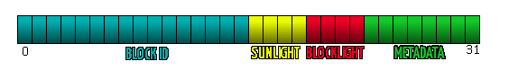

# World data structures

Chunk Stories has a concept of "worlds". Worlds are currently a fixed-sized in Chunk Stories, but they have a neat feature where they will wrap arround their borders: Walking long enough in the same direction means you'll reach your starting point. Worlds have a current max limit of 65x65km (1m = 1 block wide), and 1024 blocks of height. These limits are to be removed entirely by an upcomming refactor.

## Hierarchical storage

Like other Voxel engines, Chunk Stories has a concept of Chunks and Regions. In Chunk Stories, chunks are units of space measuring 32 by 32 by 32 units. These store as many voxels (voxels are 1 unit cubes). Chunks are then stored together on disk by Regions, which are currently 8x8x8, for reducing disk IO and improving compression. Additionally, since Chunk Stories uses cubical chunks instead of vertical slices, we like to always have handy the maximum block height and type for a given X/Z position. For that we have Heightmaps, which store a 8x8 chunks worth of surface level information. These are loaded independantly and are what allow for the "render far terrain as a heightmap mesh" feature we have.

## Voxel cells data format

Stores all voxels in 32-bit signed ints ( Java won't allow unsigned primitive datatypes, but we can still pack 32 bits worth of data in signed integers anyway )

These 32 bits are then split like so:

 * 0->15 16-bit block**I**D, allowing for 65536 different block types
 * 16->19 4-bit **S**unlight
 * 20->23 4-bit **B**locklight
 * 24->31 8-bit **M**eta data

The `VoxelFormat` helper class available in the api has methods to pack/unpack the raw cell data.

### Voxel Components

Additionally Voxels can have supplementary data in the form of components attached to them. This is usefull for storing extra data such as chests contents, sign text, and adding animated models to a voxel. These are stored in a hashmap alongside the voxel data in the chunks.

### Modifying cells

The Chunk Stories API exposes peek() and poke() methods to touch the voxel data. These operate are available both for the World object and for the various Chunks that make it up. When calling peek/poke on the world, the method is actually forwarded to the corresponding chunk, if it is loaded. If it isn't the call is simply discarded, and an air block is assumed for the peek() method.

## Loading World data

World data is loaded by explicit request, by using a WorldUser token ( any object implementing WorldUser is a suitable token ) and calling the appropriate register/unregister methods on the respective ( Chunk, Region, Heightmap ) manager. There is little safeguard and no garbage collection, so make sure to keep arround the tokens you use to register world data and always free it once you no longer need it.