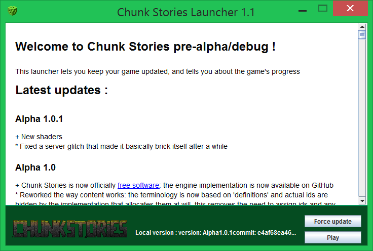

# Installation guide

## System requirements

The game is built as scalable as can be, and runs on as wide a variety of hardware as we can. However there are limits to what we can optimize for without compromising the experience for the majority of players with decent machines, so we have some arbitrary restrictions on what will be supported.

| Component | Requirement | Recommandation | Reason |
| --- | --- | --- | --- |
| CPU | 64-bit x86 CPU | Quad-core i5 or Ryzen | 32-bit x86 is dead, your Pentium III wouldn't cut it anyways. An ARM port is doable but not planned at the moment. |
| GPU | Vulkan or OpenGL 3.3 support | Any good value 200$ GPU within the last 5 years | We don't offer support for ancient APIs and hardware: it's a waste of our time, and would just result in the game running like crap anyways. |
| RAM | 4GB | 8GB | With high view distances the ram usage will scale by a square factor. Consider 16GB if pushing extreme view distances. |
| OS | Windows Vista, Linux | OSX may work, not supported | Macs don't have native Vulkan support and no major devs owns one. Windows XP is 32-bit only and 17 years old, so it can bugger off. |
| Drive space | 500MB free space | 1GB free space | The game isn't actually even 500Mb but it's a bad idea to live with an almost-full drive |

## Installing

The simplest way is simply to go to our [site](https://chunkstories.xyz) and download the launcher, from there it will create a `.chunkstories` folder on your home folder and download all the necessary files.

The only prerequisite is to have some flavour of the JVM installed <!-- Warning: Update this bit if we actually bundle a JVM ! -->, we recommand going with OpenJDK 8 or 11, as Oracle's implementation of the JVM isn't free software and is in fact planned to become paid for in the not-too-distant future. OpenJDK is as performant as the Oracle JVM so you don't have to worry about this. [Click here to download OpenJDK](https://adoptopenjdk.net/) from the AdoptOpenJDK initiative.

## Running

Click the "Play" button.

## Registering an account

The game will ask you to register an account, you can do that on [this](https://chunkstories.xyz/register.php) page. This is free and used for making usernames uniques accross all servers.

 We don't do anything beyond game authentication with your data, we know this registration prompts makes some users uncomfortable, it's actually a holdout from earlier games that were used as the base for Chunk Stories codebase, and there are plans for allowing other login methods, but these are unfortunately currently low-priority and buried under more urging matters. Pull requests will absolutely be considered !

## Uninstalling

Delete the `.chunkstories` folder. For reference, here are the locations this folder will actually be on depending on your OS:

| OS | Location | Note |
| --- | --- | --- |
| Windows Vista and above | `C:\Users\<You>\AppData\Roaming\.chunkstories` | Windows + R and `%appdata%/.chunkstories` |
| Linux and other UNIX systems | `~/.chunkstories` | |

## Building from sources

Please see the annex to the first chapter of the content creation guide for instructions on how to build the game from sources !